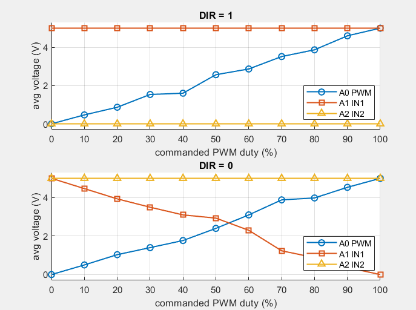

=== SN7400 NAND board characterization ===
  D9 = PWM in,  D8 = DIR in
  A0 = PWM readback,  A1 = IN1,  A2 = IN2
  VCC = 5.00 V,  NAVG = 150  (inverting/active-low expected)

DIR             duty |   A0       A1       A2    
----------------------------------------------------
DIR=HI            0% |   0.00     5.00     0.00
DIR=HI           10% |   0.47     5.00     0.00
DIR=HI           20% |   0.87     5.00     0.00
DIR=HI           30% |   1.53     5.00     0.00
DIR=HI           40% |   1.60     5.00     0.00
DIR=HI           50% |   2.57     5.00     0.00
DIR=HI           60% |   2.87     5.00     0.00
DIR=HI           70% |   3.52     5.00     0.00
DIR=HI           80% |   3.87     5.00     0.00
DIR=HI           90% |   4.60     5.00     0.00
DIR=HI          100% |   5.00     5.00     0.00
----------------------------------------------------
DIR=LO            0% |   0.00     5.00     5.00
DIR=LO           10% |   0.50     4.47     5.00
DIR=LO           20% |   1.03     3.93     5.00
DIR=LO           30% |   1.40     3.50     5.00
DIR=LO           40% |   1.77     3.10     5.00
DIR=LO           50% |   2.40     2.93     5.00
DIR=LO           60% |   3.10     2.30     5.00
DIR=LO           70% |   3.88     1.23     5.00
DIR=LO           80% |   3.98     0.88     5.00
DIR=LO           90% |   4.53     0.37     5.00
DIR=LO          100% |   5.00     0.00     5.00
----------------------------------------------------

=== What each probe actually reads ===
  A0:
     DIR=1 : tracks PWM (rises 0.00->5.00 V) -- non-inverting
     DIR=0 : tracks PWM (rises 0.00->5.00 V) -- non-inverting
  A1:
     DIR=1 : constant HIGH (~5.00 V)
     DIR=0 : tracks /PWM (falls 5.00->0.00 V) -- inverting NAND (normal)
  A2:
     DIR=1 : constant LOW  (~0.00 V)
     DIR=0 : constant HIGH (~5.00 V)

  Reminder: a healthy SN7400 gives NON-inverting PWM on the
  buffered readback, but INVERTED PWM (falls with duty) on the
  active IN line, HIGH on the idle IN line, and a clean NOT-DIR on
  the direction node. A node stuck at a fixed mid voltage that
  ignores both inputs is almost certainly a loose/misplaced probe.

