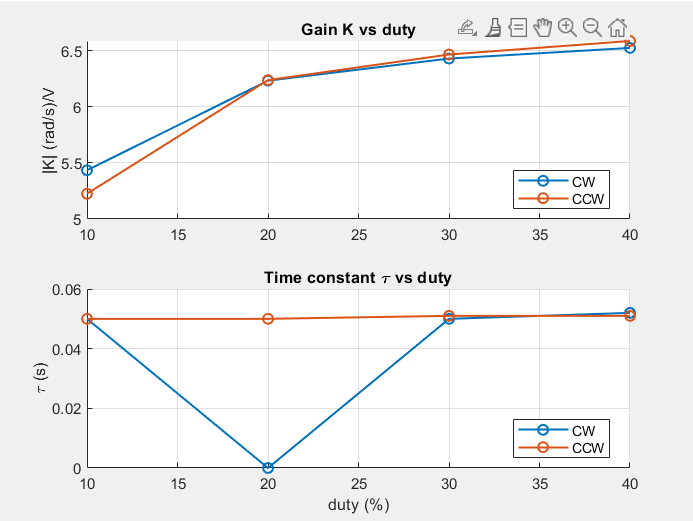
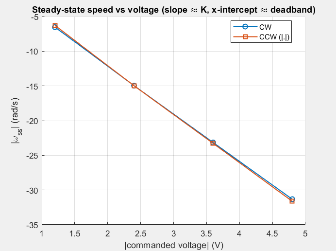
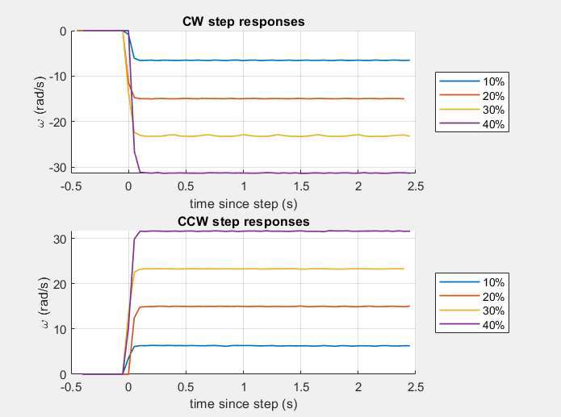

dir    duty   v (V) |   omega_ss        K   tau (s)
----------------------------------------------------
CW      10%    1.20 |      -6.52   -5.434     0.050
CW      20%    2.40 |     -14.96   -6.233     0.000
CW      30%    3.60 |     -23.15   -6.430     0.050
CW      40%    4.80 |     -31.32   -6.525     0.052
----------------------------------------------------
CCW     10%   -1.20 |       6.27   -5.225     0.050
CCW     20%   -2.40 |      14.97   -6.238     0.050
CCW     30%   -3.60 |      23.28   -6.466     0.051
CCW     40%   -4.80 |      31.62   -6.587     0.051
----------------------------------------------------

All 8 bump tests done.
Saved bump_tests_raw.csv (raw samples) and bump_tests_summary.csv (per-test fits).

=== Identified model  omega/V = K/(tau*s + 1) ===
  CW : K = 6.4303 (rad/s)/V,  tau = 0.0500 s
  CCW: K = 6.4665 (rad/s)/V,  tau = 0.0510 s
  Design point (both-dir avg): K = 6.4484 (rad/s)/V,  tau = 0.0505 s
  Deadband: CW starts ~10% duty, CCW starts ~10% duty

=== Angular-VELOCITY loop  (PI, plant K/(tau s+1)) ===
  target: ~5x faster than open loop (closed-loop tau ~ 0.010 s)
  Kp_v = 0.7754  V/(rad/s)
  Ki_v = 15.3541  V/(rad/s)/s   (Ti = tau = 0.050 s)

=== ANGLE loop, angle mod pi  (PD, plant K/(s(tau s+1))) ===
  target: zeta = 0.80, settling ~0.40 s  ->  wn = 12.50 rad/s
  Kp_p = 1.2237  V/rad
  Kd_p = 0.0016  V/(rad/s)

  Firmware note: set g_pid.kp = Kp_p, g_pid.kd = Kd_p, g_pid.ki = 0 for the
  angle PD. Half-turn symmetric control: reduce the angle mod pi and wrap
  the error into [-pi/2, pi/2] before the PID:
    theta_m = mod(theta, pi);  e = mod(target - theta_m + pi/2, pi) - pi/2;
  Validate with validate_tuning.m (expected sim vs actual motor run).

